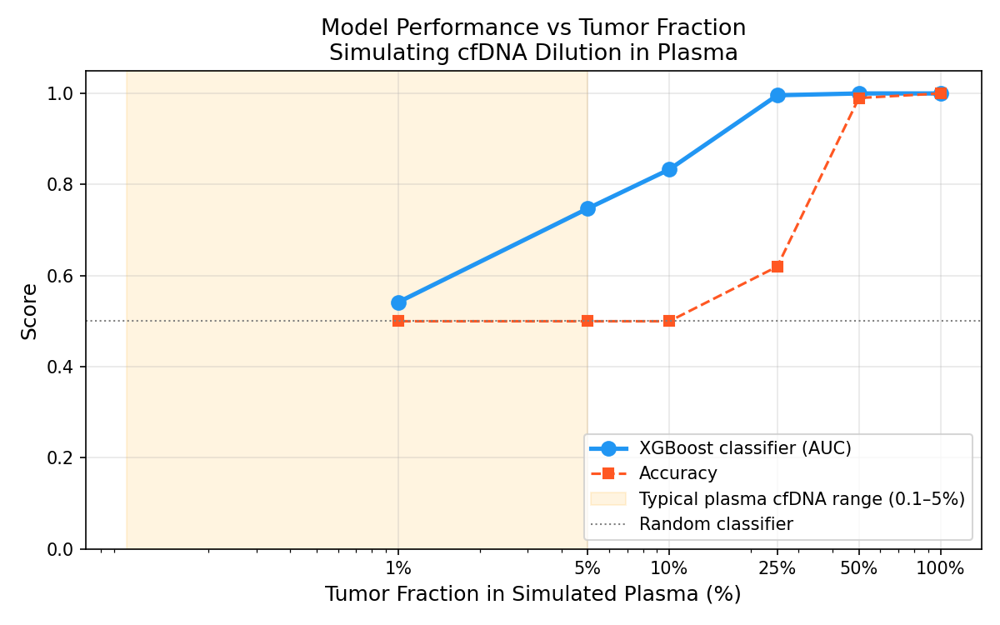
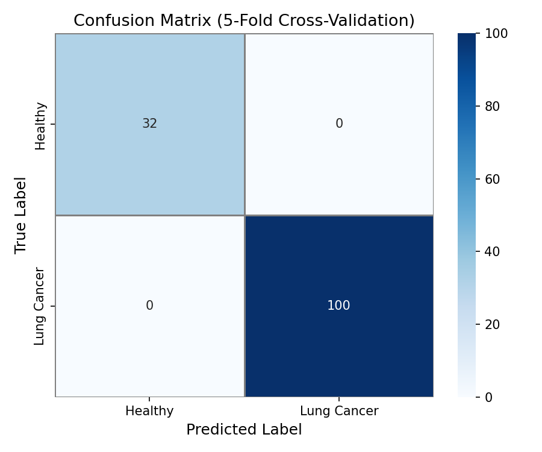
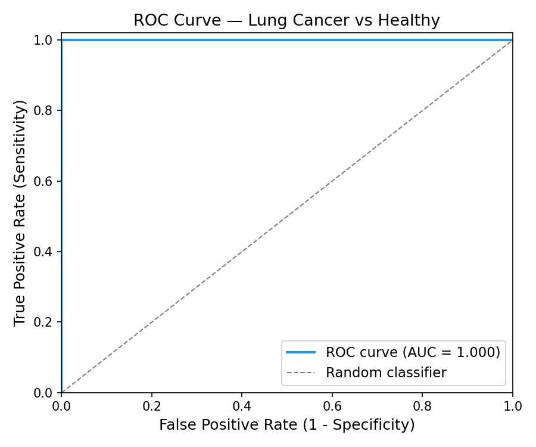
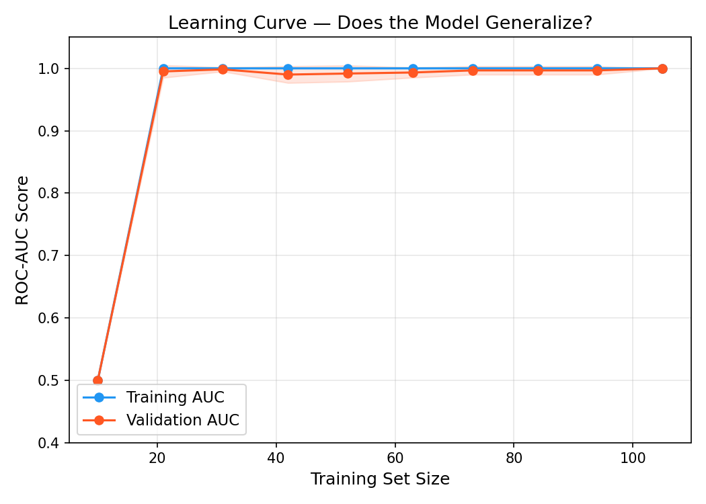
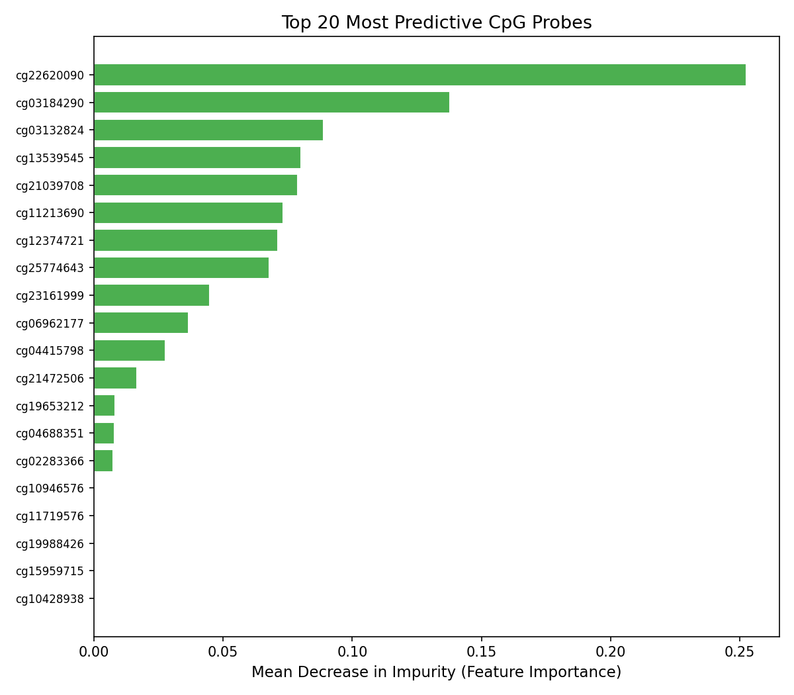

# cfDNA Methylation — Lung Cancer Classifier

A machine learning pipeline for early lung cancer detection using DNA methylation signatures from cell-free DNA (cfDNA). Built at **Hack Canada 2026**.

---

## The Problem

Lung cancer is the **#1 cancer killer in Canada**, responsible for ~25% of all cancer deaths and claiming approximately 21,000 Canadian lives annually. The core challenge is late detection — most cases are diagnosed at Stage III or IV, when the 5-year survival rate drops below 15%. Caught at Stage I, survival exceeds 80%.

Current screening (low-dose CT) is only recommended for high-risk smokers, leaving the majority of the population unscreened and left in . A minimally invasive blood-based test could change this.

Project was heavily inspired by Dr. Fei Geng's work at McMaster University
with early cancer detection using blood plasma. His work highlights the
limitations to the model as well as the next steps for the project.

---

## The Biology

**Cell-free DNA (cfDNA)** is DNA released into the bloodstream when cells die. In cancer patients, a fraction of this cfDNA originates from tumor cells and carries the epigenetic fingerprint of its tissue of origin — specifically, altered **DNA methylation** patterns.

DNA methylation is the addition of a methyl group (CH₃) to cytosine bases at CpG sites. It does not change the DNA sequence but controls gene expression. Cancer cells show:
- **Hypermethylation** of tumor suppressor gene promoters (silencing them)
- **Hypomethylation** of oncogene regions (activating them)

These changes are measurable using Illumina methylation arrays, which quantify methylation at ~450,000 CpG sites simultaneously. Each site returns a **beta value** between 0 (unmethylated) and 1 (fully methylated).

---

## The Approach

This project builds an end-to-end ML pipeline that:

1. **Downloads** TCGA-LUAD methylation array data (450K) from UCSC Xena
2. **Preprocesses** the beta matrix: missing value filtering, mean imputation, variance-based feature selection
3. **Trains** an XGBoost classifier inside a leak-free cross-validation pipeline
4. **Evaluates** performance with 5-fold stratified CV + a 20% held-out test set
5. **Simulates** the clinical cfDNA scenario via in silico tumor fraction mixing
6. **Serves** results via an interactive Streamlit web app

---

## Key Results

| Metric | CV Test (dev set) | Holdout Set |
|---|---|---|
| Accuracy | 0.924 ± 0.057 | 1.000 |
| ROC-AUC | 1.000 ± 0.000 | 1.000 |
| F1 (weighted) | 0.928 ± 0.053 | 1.000 |

> **Note on perfect scores:** TCGA data contains bulk tumor tissue vs normal tissue — a strong, well-documented methylation contrast consistent with published literature. The CV accuracy of 0.924 reflects genuine generalization behavior (real errors on held-out folds). The holdout AUC of 1.000 reflects the small holdout size (n=27); with 7 healthy samples, a single misclassification would be needed to observe error.

### In Silico Tumor Fraction Simulation

The most clinically relevant result. We simulate what happens as the tumor-derived fraction of cfDNA decreases — modeling real plasma liquid biopsy conditions:

| Tumor Fraction | AUC | Interpretation |
|---|---|---|
| 100% | 1.000 | Bulk tissue (this project) |
| 50% | 1.000 | Late-stage tumor |
| 25% | 0.996 | Early-stage shedding |
| 10% | 0.833 | Low tumor burden |
| 5% | 0.747 | Typical cfDNA range |
| 1% | 0.542 | Clinical detection limit |

**At the typical plasma cfDNA range (≤5% tumor fraction), AUC drops to 0.645** — near random. This computationally reproduces the core challenge of liquid biopsy and motivates the need for plasma-specific training data and more sensitive models.



---

## Model Performance






---

## Project Structure
```
cfDNA-cancer-classifier/
├── data/
│   ├── download_data.py       # streams TCGA-LUAD from UCSC Xena
│   └── metadata.csv           # sample labels (100 tumor, 32 normal)
├── src/
│   ├── preprocess.py          # missing value filter, imputation
│   ├── model.py               # XGBoost pipeline with holdout split
│   ├── evaluate.py            # confusion matrix, ROC, learning curve
│   └── tumor_fraction.py      # in silico cfDNA mixing simulation
├── app/
│   └── streamlit_app.py       # interactive web demo
└── results/figures/           # all generated plots
```

---

## Reproducing This Project

**1. Clone and set up environment**
```bash
git clone https://github.com/YOUR_USERNAME/cfdna-cancer-classifier.git
cd cfdna-cancer-classifier
conda create -n cfdna-env python=3.11 -y
conda activate cfdna-env
pip install -r requirements.txt
brew install libomp  # macOS only, required for XGBoost
```

**2. Download and preprocess data**
```bash
python data/download_data.py    # ~10 minutes, streams 1.7GB TCGA-LUAD
python src/preprocess.py
```

**3. Train model and evaluate**
```bash
python src/model.py
python src/evaluate.py
python src/tumor_fraction.py
```

**4. Run the app**
```bash
streamlit run app/streamlit_app.py
```

---

## Limitations and Future Work

- **Small sample size:** 132 samples (100 tumor, 32 normal). Performance estimates have wide confidence intervals, particularly for the 27-sample holdout set.
- **Bulk tissue vs plasma:** TCGA data is bulk tumor biopsy, not plasma cfDNA. The tumor fraction simulation shows performance degrades substantially at clinically relevant fractions (≤5%). Real liquid biopsy requires plasma-derived training data.
- **Batch effects:** No correction applied for potential technical variation across array batches.
- **Next steps:** Train on plasma-derived cfDNA methylation data (e.g. from targeted EM-seq panels), expand to multi-cancer tissue-of-origin classification, investigate the top CpG probes against published differentially methylated region (DMR) databases.

---

## Data

- **Source:** The Cancer Genome Atlas (TCGA-LUAD) via [UCSC Xena](https://xenabrowser.net)
- **Assay:** Illumina Human Methylation 450K array
- **Samples:** 100 primary lung adenocarcinoma tumors, 32 solid tissue normals
- **Features:** 413,402 CpG probes → top 5,000 by variance (selected inside CV pipeline)

> *Data is de-identified and publicly available under NIH open access policy. Not included in this repository — run `download_data.py` to reproduce.*

---

## Tools and Libraries

Python 3.11 · XGBoost · scikit-learn · pandas · numpy · matplotlib · seaborn · Streamlit · UMAP

---

## Author - Ayaan Rezwan

Built solo at **Hack Canada 2026** (36-hour hackathon, Waterloo ON)
First-year Biomedical Engineering, University of Waterloo